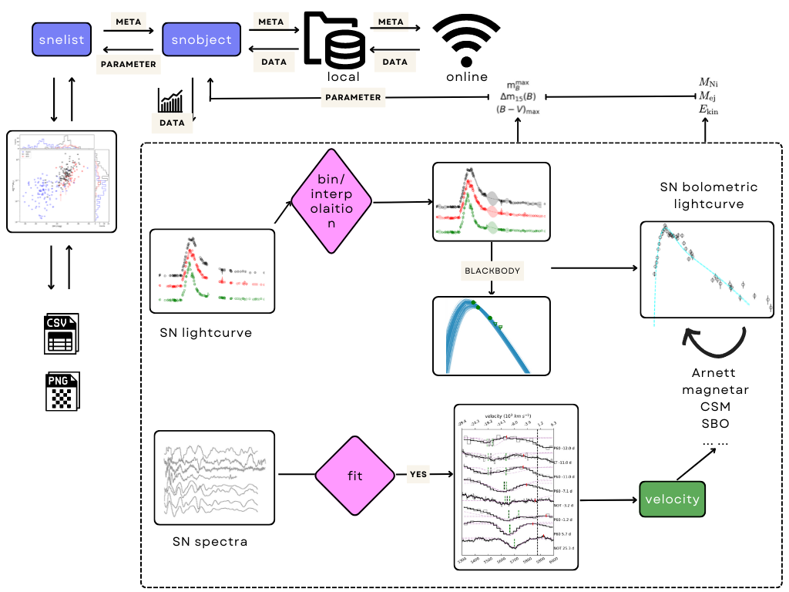

Tutorial
===================================

The aim of `sdapy` is to handle observational data for a set of targets, to estimate their physical parameters, and visualize the population of inferred parameters. Therefore, there're two classes defined, i.e. `ztfsingle` is to deal with one specific object, and `ztfmultiple` is to organise the overall runnings for multiple objects, store their fitting results, which can be visualize with the help of `plotter`. The inheritance scheme of `sdapy` is shown as directed flowchart as followed:

:ref:`1. ztfsingle  <single>`
--------------------------------------------------

:ref:`2. ztfmultiple and plotter <multiple>`
----------------------------------------------
