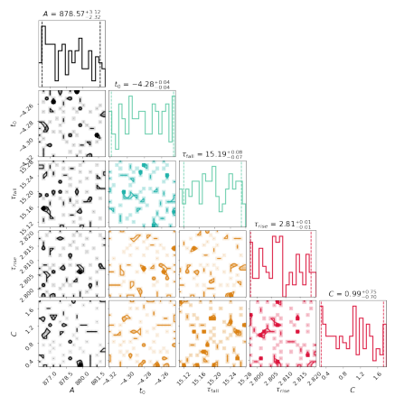
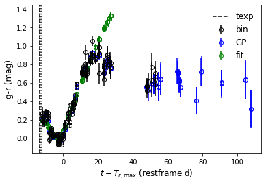
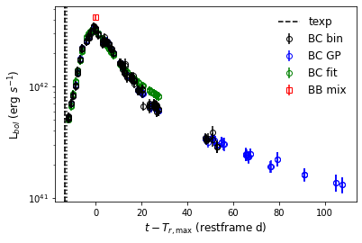
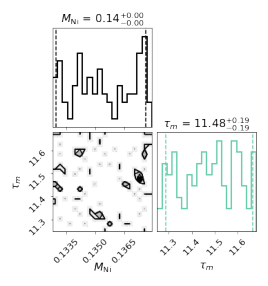
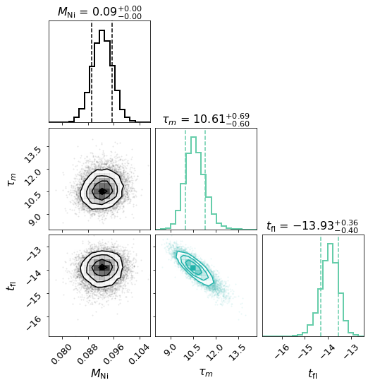

.. _package:

:mod:`Python package, snerun`
===========================================

| :ref:`Previous: The executable file <exe>`
| :ref:`Back: Getting started <getstart>`

| :ref:`- snobject <package1>`
|              :ref:`Input data <package11>`
|              :ref:`Gaussian Process and multiband fittings <package12>`
|              :ref:`Colours, bolometric LCs and bolometric LC fittings <package13>`
|              :ref:`Spectral line fittings and the photospheric velocities <package14>`
| :ref:`- snelist <package2>`

`HAFFET` can be also used as a Python package:

.. code-block:: bash
   
   >>> from sdapy import snerun
   
Here, we show examples to use `sneobject` and `snelist` classes below.

.. _package1:

Example of snobject
----------------------------------------

.. note::
   
   They're also avaliable in jupyter-notebook at https://github.com/saberyoung/HAFFET/blob/master/notebook/ZTF20aajcdad.ipynb
   
`sneobject` class is designed to deal with data and fittings for one object.
So the first step is to initialize a `snobject` class with proper meta data of a SN:

.. code-block:: bash
   
   >>> from sdapy import snerun
   >>> sncls = snerun.snobject(objid='ZTF20aajcdad', aliasid='SN2020bcq',\
   ...      z=0.0186, dm=34.6, mkwebv=0.01387, hostebv=0, sntype='Ib', \
   ...      ra='13:26:29.65', dec='+36:00:31.1', jdpeak=2458888.02)
   
This defines a **sncls** class for `SN2020bcq`.
For `sneobject`, the Object ID (`objid`), redshift (`z`) and the distance module (`dm`) should be all given correctly, however for `snelist`, it would define `sneobject` for each object, and there, the Object ID (`objid`) is the only item required as the identifier of an object. The rest of parameters can be calculated or queried via build-in functions. Check :ref:`snelist <package2>` for more deatisl.

There're build functions to standardize meta, such as:

.. code-block:: bash

   # get coordinate in degress
   >>> sncls.parse_coo(deg=True)
   (201.62354166666665, 36.00863888888889)

   # get coordinate healpix index
   >>> sncls.parse_coo(deg=False, hpx=True, nside=512)
   649093

   # get current julian date
   >>> sncls.mjd_now(jd=True)
   2459809.1902771713

.. _package11:

Input data
----------------------------------------

Then we should assign observational data to the defined **sncls** class. User can either use their own private data or public data from online sources. In `HAFFET`, we use `pandas.DataFrame <https://pandas.pydata.org/docs/reference/api/pandas.DataFrame.html>`_ to deal with csv tables, and asked essential columns, i.e. 'jdobs', and 'mag'/'emag' or 'flux'/'eflux'.

An easiest way to input photometric data is to manually add it:

.. code-block:: bash
      
   >>> import pandas as pd
   >>> from io import StringIO
   >>> df = pd.readcsv(StringIO('\
   ...   filter jdobs    mag  emag\n \
   ...	 r      2459000  18   0.05\n \
   ...   g      2459000  18.5 0.08\n \
   ...   r      2459001  18.1 0.05\n \
   ...   g      2459001  18.6 0.08'), delim_whitespace=True)
   
   # define a source name
   >>> source = 'test'

   # add lc
   >>> sncls.add_lc(df, source=source)

   # add flux columns
   >>> sncls.add_flux(zp=23.9, source=source)
   
There're built-in functions that can help query public photometric and spectroscopic data from online sources. All the downloaded data are stored with a specific format in the defined data directory. 
Let's query and load ATLAS forced photometry data for `SN2020bcq` as an example:

.. note::
   
   For public data access, a proper list of accounts or tokens should be set correctly in the auth.txt file (the one in the defined data directory)

.. code-block:: bash

   # set a proper ATLAS account   
   >>> vi /xxx/yyy/haffet_data/auth.txt   
   [atlas]     ;   ------------   ATLAS force photometry
   usr:     xxxx     # str # username
   pwd:     yyyy     # str # password
   
   # OK, then we can start HAFFET
   >>> python
   >>> from sdapy import snerun
   >>> sncls = snerun.snobject(objid='ZTF20aajcdad', aliasid='SN2020bcq',\
   ...      z=0.0186, dm=34.6, mkwebv=0.01387, hostebv=0, sntype='Ib', \
   ...      ra='13:26:29.65', dec='+36:00:31.1', jdpeak=2458888.02)

   # And query data from ATLAS server
   >>> sncls.query_fp_atlas()
   13:26:29.65 use unit hourangle
   use current mjd
   Your token is xxxxxxxxxxxxxxxxxx
   Store this by running/adding to your .zshrc file:
   export ATLASFORCED_SECRET_KEY="xxxxxxxxxxxxxxxxxx"
   The task URL is https://fallingstar-data.com/forcedphot/queue/xxxx/
   Waiting for job to start (queued at 2022-04-12T12:03:29Z)
   Waiting for job to start (queued at 2022-04-12T12:03:29Z)
   Waiting for job to start (queued at 2022-04-12T12:03:29Z)
   Task is running (started at 2022-04-12T12:07:56Z)
   Task is complete with results available at https://fallingstar-data.com/forcedphot/queue/xxxx/data.txt
   
   # After for a while, the ATLAS data is stored in your defined data directory
   # let's put them into **sncls**, with a one day binning
   >>> sncls.get_fp_atlas(binDays=1, clobber=False)
   
   # they're there now in the sncls.lc
   >>> print (sncls.lc.query('source == "atlasfp"').iloc[0])
   MJD              58800.6
   absmag               NaN
   date                 NaN
   eflux              22.63
   emag                  99
   filter                 o
   flux                  24
   instrument           NaN
   isdiffpos            NaN
   issub                NaN
   jdobs         2.4588e+06
   limmag           18.7659
   mag                   99
   n                      2
   programid            NaN
   rb                   NaN
   refsys               NaN
   source           atlasfp
   Name: 0, dtype: object

It's quite similar for other photometric services as well, e.g. ZTF forced photometry:

.. code-block:: bash

   # for instance the ZTF forced photometry
   # edit the correct account
   >>> vi /xxx/yyy/haffet_data/auth.txt
   [ztf]     ;   ------------     ZTF force photometry
   email:    xx,yy@zzz.com   # str # email
   pwd:      123456          # str # password
   
   # then the same, start HAFFET, query data, and input local data to defined class
   >>> python
   >>> from sdapy import snerun
   >>> sncls = snerun.snobject(...)
   
   # Note:
   # Here, set get_email to False, will download data to proper directory via an API, it's easy but will stuck you for a while
   #       set get_email to True, will send request to server, you'll receive an email later with the photometry file, and in the meanwhile, you can so other things
   >>> sncls.query_fp_ztf(get_email=True)   
   >>> sncls.get_fp_ztf()
   
   # for Open Astronomy Catalog, they're fully public, so no authorization is needed
   >>> sncls.query_oac(db='AL', which='photometry')
   >>> sncls.get_oac(which='photometry')

   # for internal ZTF collaborators, set proper marshal/fritz accounts and then
   >>> sncls.query_alert_ztf(source='fritz')
   >>> sncls.get_alert_ztf(source='fritz')

And it's also similar for the spectra:

.. code-block:: bash
		
   >>> sncls.query_spectra(source='fritz')
   >>> sncls.get_local_spectra()

   >>> sncls.query_oac(db='AL', which='spectra')
   >>> sncls.get_oac(which='spectra')

OK, now we can plot the LCs and spectra:

.. code-block:: bash

   >>> from matplotlib.pyplot as plt
   
   # In HAFFET, by default:
   #    ax is the flux LC plot
   #    ax1 is the spectral plot
   #    ax2 is the magnitude LC plot
   #    ax3 is the bolometric LC plot
   #    ax4 is the colour plot
   >>> sncls.fig, sncls.ax = plt.subplots(1,1)
   
   # call ax plot, show only ztffp (ZTF forced photometry data)
   >>> sncls._ax(source='ztffp')
   

.. code-block:: bash
   
   >>> fig, ax = plt.subplots(1,1)
   >>> sncls.ax1 = ax
   >>> sncls._ax1()

.. image:: ../static/example2.png
   :width: 400

.. note::

   One may need `plt.show() <https://matplotlib.org/stable/api/_as_gen/matplotlib.pyplot.show.html>`_ to display all open figures, or use :py:meth:`sdapy.snerun.snobject.savefig` to save the current fig to data directory and :py:meth:`sdapy.snerun.snobject.showfig` to show it.
   
A build-in function is available to guess transient type based on multiple band LCs, via `astrorapid <https://astrorapid.readthedocs.io/en/latest/index.html>`_:

.. code-block:: bash

   >>> fig, ax = plt.subplots(1,1)
   >>> sncls.rapid(ax=ax)

.. image:: ../static/example3.png
   :width: 400

And at some point, a ZTF transient might be covered by multiple CCDs, thus zeropoints of different fields might be different since they're calibrated with different set of standards stars. `HAFFET` provide functions to compared their baselines so that flux zeropoints would be consistent:

.. code-block:: bash

   >>> fig,ax=plt.subplots(1,1)
   >>> baseline = sncls.calibrate_baseline(ax=ax, key='fcqfid', source='ztffp', xmin=-100, xmax=-20)
   >>> sncls.correct_baseline(baseline, key='fcqfid', source='ztffp')

Users might detailly explore more possible functions at the :ref:`API <snobject>` page, and now that's go to the fitting part.

.. _package12:

Gaussian Process and multiband fittings
----------------------------------------

We can interpolate multiple band LCs via Gaussian Process (GP), and the analytic model fittings.

First let's try GP:

.. code-block:: bash

   # GP with ZTF gri + ATLAS co with default settings
   >>> sncls.run_gp(gp_bands=['r', 'g', 'i', 'c', 'o'])

   # set t0 as the epoch with maximum brighness in r band
   >>> sncls.set_peak_gp('r') # set t0 with GP in r band
   
   # then let's plot the GP interpolation
   >>> sncls.fig,(sncls.ax, sncls.ax2)=plt.subplots(2,1)
   >>> sncls._ax(plot_bands=['r', 'g', 'i', 'c', 'o'], show_title=False)
   >>> sncls._ax2(plot_bands=['r', 'g', 'i', 'c', 'o'])

.. image:: ../static/example5.png
   :width: 400

With GP as the estimated mean, we can clip the LCs, removing those outlier datapoints:

.. code-block:: bash
		
   >>> sncls.clip_lc(clipsigma=5)

We can also use model fittings instead for interpolation purpose.
There're build-in functions that can be used to check all possible engines and models:

.. code-block:: bash
		
   >>> from sdapy.model_fitters import get_engine
   >>> get_engine()
   {'bol_full': <function sdapy.engines.bol_full.engine(self, model_name, engine_name, sourcename=None, **kwargs)>,
   'multiband_main': <function sdapy.engines.multiband_main.engine(self, model_name, engine_name, sourcename=None, **kwargs)>,
   'specv_evolution': <function sdapy.engines.specv_evolution.engine(self, model_name, engine_name, sourcename=None, modelname=None, quant=[0.05, 0.5, 0.95], **kwargs)>,
   'specline': <function sdapy.engines.specline.engine(self, model_name, engine_name, sourcename=None, **kwargs)>,
   'bol_main': <function sdapy.engines.bol_main.engine(self, model_name, engine_name, sourcename=None, **kwargs)>,
   'multiband_early': <function sdapy.engines.multiband_early.engine(self, model_name, engine_name, sourcename=None, **kwargs)>,
   'bol_tail': <function sdapy.engines.bol_tail.engine(self, model_name, engine_name, sourcename=None, **kwargs)>,
   'bol_early': <function sdapy.engines.bol_early.engine(self, model_name, engine_name, sourcename=None, **kwargs)>}

As shown, for multiple band LCs, there're two engines available, i.e. **mainband_early** and **multiband_main**. Let's start with the **mainband_main** models:

.. code-block:: bash
		
   >>> from sdapy.model_fitters import get_model
   >>> get_model(which_engine='multiband_main', with_alias=True)
   {'multiband_main': ['villar',
   'villar',
   'salt',
   'salt2',
   'salt2_fit',
   'bazin1',
   'bazin',
   'bz',
   'bz1',
   'bazin2',
   'bz2']}

We fit with **bazin** model as examples.
Let's find more details about the **bazin** model:

.. code-block:: bash
		
   >>> from sdapy.model_fitters import get_pars
   >>> get_pars('bazin', with_alias=True)
   {'func': <function sdapy.models.bazin.functions.bazin(time, A, t0, tfall, trise, C)>,
   'engine': <function sdapy.engines.multiband_main.engine(self, model_name, engine_name, sourcename=None, **kwargs)>,
   'enginename': 'multiband_main',
   'parname': ['$A$',
   '$t_\\mathrm{0}$',
   '$\\tau_\\mathrm{fall}$',
   '$\\tau_{rise}$',
   '$C$'],
   'par': ['a', 'dt', 'tfall', 'trise', 'c'],
   'same_parameter': [],
   'fit_error': False,
   'bestv': [100.0, 0, 20, 10, 60],
   'bounds': ([0, -100, 0, 0, 0], [10000, 100, 120, 60, 10000])}

This provides us the mean, engine function, parameter name, its latex format, and the prior and boundaries. Moreover, the **same_parameter** can decide whether perform fittings in different band seperately, or together with one or more common parameters. The **fit_error** parameter decide if include additional errors accounting for models into the likelihood.

There're different routines can be applied to optimize the hyperparameters.
Below, we fit the **bazin** model with `scipy.minimize <https://docs.scipy.org/doc/scipy/reference/generated/scipy.optimize.minimize.html>`_ (check more options at https://github.com/saberyoung/HAFFET/blob/master/sdapy/data/default_par.txt):

.. code-block:: bash
		
   >>> sncls.run_fit('multiband_main',
   ...      fit_methods = ['bazin'],
   ...      multiband_main_bands = ['i','g','r'],
   ...      multiband_main_xrange = [-50, 50], 
   ...      multiband_main_xrangep = [-50, 50], 
   ...      multiband_main_routine = 'minimize',
   ...      fit_redo = True)

With **scipy.minimize**, we obtain perr (the Optimal values for the parameters) and pcov (The estimated covariance of popt). We randomly select parameters from perr +/- sqrt(pcov) * sigma:

.. code-block:: bash
		
   >>> fig, ax = plt.subplots(1,1,figsize=(8,8))
   >>> sncls.show_corner(ax, index=0, gp=False, engine=None, model='bazin', source=None, filts=['r'], clobber=False)

Another possible routine is monte carlo markov chain (**mcmc**).
In `HAFFET`, we use results from **scipy.minimize** to set the priors, and run mcmc by using `emcee <https://emcee.readthedocs.io/en/stable/>`_. The monte carlo optimization on **bazin** model can be run as:

.. code-block:: bash
		
   >>> sncls.run_fit('multiband_main',
   ...      fit_methods = ['bazin'],
   ...      multiband_main_bands = ['i','g','r'],
   ...      multiband_main_xrange = [-50, 50], 
   ...      multiband_main_xrangep = [-50, 50], 
   ...      multiband_main_routine = 'mcmc',
   ...      nwalkers = 30,
   ...      nsteps = 20000,
   ...      nsteps_burnin = 2000,
   ...      fit_redo = False,
   ...      source = None)

And the corner plots showing how the parameters converged can be called with:

.. code-block:: bash
		
   >>> fig, ax = plt.subplots(1,1,figsize=(8,8))
   >>> sncls.show_corner(ax, index=0, gp=False, engine=None, model='bazin', source=None, filts=['r'], clobber=False)

.. image:: ../static/example6.png
   :width: 400   

And we can overplot the fitting samplings into the flux and magnitude plots.
We mention besides calling subplots, e.g. `sncls._ax1()`, a summarizing plot function is available to show all subplots together (Note by defaul ``HAFFET`` calculate g-r colours and estimate bolometric LCs via Lyman bolometric correction functions):

.. code-block:: bash
		
   >>> sncls.summarize_plot(ax=None)
   
.. image:: ../static/example7.png
   :width: 400  

Then let's try fitting with the **powerlaw_multiple** models as an example for the **mainband_main** engine:

.. code-block:: bash
		
   >>> get_model(which_engine='multiband_early', with_alias=True)
   {'multiband_early': ['powerlaw_multiple',
   'pl',
   'powerlaw',
   'powerlaw',
   'powerlaw_single',
   'pl2',
   'powerlaw2',
   'powerlaw2',
   'pl_single',
   'powerlaw_single']}

   >>> get_pars('powerlaw_multiple', with_alias=True)
   {'func': <function sdapy.models.risepl.functions.powerlaw_full(times, t_0=0, amplitude=25, alpha_r=2, c=0)>,
   'engine': <function sdapy.engines.multiband_early.engine(self, model_name, engine_name, sourcename=None, **kwargs)>,
   'enginename': 'multiband_early',
   'parname': ['$t_\\mathrm{fl}$', '$A$', '$\\alpha$', '$C$'],
   'par': ['texp', 'a', 'alpha', 'c'],
   'same_parameter': ['texp'],
   'fit_error': True,
   'bestv': [-18, 100, 2, 60],
   'bounds': ([-100, 0, 0, 0], [0, 10000, 10, 10000])}

As shown, the **same_parameter** is set as ['texp'], which means the fittings of different bands would be performed together with a common explosion epoch. Let's try run these on ZTF gri, togerther with ATLAS co:

.. code-block:: bash
		
   >>> sncls.run_fit(
   ...  'multiband_early',
   ...  fit_methods = ['powerlaw_multiple'],
   ...  multiband_early_bands = ['g','r','i','c','o'],
   ...  multiband_early_xrange = [-50,0],
   ...  multiband_early_xrangep = [-50,0],
   ...  multiband_early_routine = 'mcmc',
   ...  nwalkers = 200,
   ...  nsteps = 20000,
   ...  nsteps_burnin = 10000,
   ...  fit_redo = True,
   ...  source = None)

The contours can be obtained via:

.. code-block:: bash
		
   >>> fig, ax = plt.subplots(1,1,figsize=(15,15))
   >>> sncls.show_corner(ax, index=0, gp=False, engine=None, model='powerlaw_multiple', source=None,clobber=False)

.. image:: ../static/example9.png
   :width: 800

And the early LCs can be reproduced by the multiband power law models as:

.. code-block:: bash
		
   >>> sncls.fig, sncls.ax=plt.subplots(1,1)

   # set explosion epoch with r band
   >>> sncls.set_texp_pl('r', model_name=None)
   
   >>> sncls._ax(plot_bands=['r','g','i','c','o'], show_title=False, ax_ylim=(0,200), ax_xlim=(-30,0))

.. image:: ../static/example10.png
   :width: 400

Let's try fit power law on ZTF gri band LCs independently for a comparison:

.. code-block:: bash
		
   >>> sncls.run_fit(
   ...  'multiband_early',
   ...  fit_methods = ['powerlaw_single'],
   ...  multiband_early_bands = ['g','r','i'],
   ...  multiband_early_xrange = [-50,0],
   ...  multiband_early_xrangep = [-50,0],
   ...  multiband_early_routine = 'mcmc',
   ...  nwalkers = 100,
   ...  nsteps = 20000,
   ...  nsteps_burnin = 10000,
   ...  fit_redo = True,
   ...  source = None)

The reproduced gri power law modelled LCs overploted with observed LCs and the GP interpolated LCs are:

.. code-block:: bash
		   
   >>> sncls.fig, sncls.ax=plt.subplots(1,1)
   >>> sncls.set_texp_pl('r', model_name=None)
   >>> sncls._ax(plot_bands=['r','g','i'], show_title=False, ax_ylim=(0,200), ax_xlim=(-30,0))
   
.. image:: ../static/example11.png
   :width: 400

Then, The r band contour is:

.. code-block:: bash
		   
   >>> fig, ax = plt.subplots(1,1)
   >>> sncls.show_corner(ax, index=0, gp=False, filts=['r'], engine=None, model='powerlaw_single', source=None,clobber=True)

Besides the contours, one may need the bestfit and errors for one specific parameter:

.. code-block:: bash

   # for instance, I want to know the fitted tau fall from the Bazin model
   >>> sncls.get_par('tfall', quant=[.05,.5,.95])

   # this will return a dictionary includes all modelling results that contain tfall as free parameter
   {'bazin None': (14.885858922707264, 15.023022856549716, 15.165647503295025)}
   
   # or the fitted power law indices from the power law fits
   >>> sncls.get_par('alpha', filt='g', quant=[.05,.5,.95])
   {'powerlaw_single None': (0.7948356612661145, 0.8783020839198484, 0.9392650238103688)}

   >>> sncls.get_par('alpha', filt='r', quant=[.05,.5,.95])
   {'powerlaw_single None': (0.5452672526172516, 0.6572905950780903, 0.7325257385397606)}
   
.. _package13:
   
Colours, bolometric LCs and bolometric LC fittings
----------------------------------------

After multiple band LCs interpolated, the next step is to match epochs from different bands for the SED and then bolometric luminosities. Moreover, we can fit these inferred bolometric LCs to some existing models to estimate their physical parameters.

In `HAFFET`, there're two approaches available to make bolometric LCs. The first one is to use the analytic functions from Lyman et al 2014, that relates the bolometric correction (BC) to the colours. Therefore, we can match colours and then convert them to bolometric magnitudes:

.. code-block:: bash

   # calculate g-r, with 3 approaches
   >>> sncls.calc_colors(color_bands=['g','r'], tdbin=1, color_interp=['bin','gp','fit'])

   # plot them
   >>> sncls.fig, sncls.ax3=plt.subplots(1,1)
   >>> sncls._ax3(show_legend=True,ylabel_2right=False)

As shown in the plot, there're three coloured dots: the black ones are from 1 day binning, while the green ones are guessing missed data from fittings, and those blue points are for GP interpolation.

Then let's calculate host galaxy extinction via colour comparisons, and call functions to convert the g-r colours to bolometric LCs:

.. code-block:: bash

   # the default hostebv is 0
   >>> print (sncls.hostebv)
   0

   # estimate g-r colour with GP interpolation, and compare to templates for hostebv   
   >>> sncls.est_hostebv_with_colours(hostebv_bands=['g','r'], hostebv_interp='gp')
   >>> print (sncls.hostebv)
   0.02128907973013693
   
   # Then make bolometric LCs
   >>> sncls.lyman_bol(interpolation=['bin','fit','gp'])

   # plot them
   >>> sncls.fig, sncls.ax4=plt.subplots(1,1)
   >>> sncls._ax4()

Another approach to make bolometric LCs is to assume the SNe fluxes during photospheric phases are roughly distributed as a blackbody (BB). Therefore we fit photometric or spectral data to the stefan boltzmann function, which was integrated within a range to represent the bolometric luminosities. In `HAFFET`, we could call:

.. code-block:: bash

   # match epochs from multiple bands for BB
   >>> sncls.bb_colors(bb_bands=['g','r','i'], tdbin=1, bb_interp=['bin','gp','fit'])

this was matching epochs from different filters, stored in ``sncls.cbb``.
Then we can run blackbody fits via the SED fitting engine.
Again, there're minimize and mcmc routines available.
Since mcmc is time consuming, we recomment to use mcmc to check fits at specific phases and minimize routine for the full bolometric budgets.
As an example, we fit blackbody for datapoints at peak epoch:

.. code-block:: bash

   >>> sncls.bb_colors(
   ...     xpred=[0], clobber=True)

   >>> sncls.run_fit(
   ...     'sed',
   ...     make_bol=['bb'],
   ...     sed_routine = 'mcmc',
   ...     nwalkers = 30,
   ...     nsteps = 2000,
   ...     nsteps_burnin = 1000,
   ...     fit_redo = True,
   ...     sed_color_interp_mix = True)
   
Let's show the fitting contous:

.. code-block:: bash

   >>> fig, ax = plt.subplots(1,1,figsize=(8,8))
   >>> sncls.show_corner(
   ...     ax, engine='sed', clobber=True, filts=None)

.. image:: ../static/example33.png
   :width: 400

Here, T is temperature with unit of 1000 Kelvin, and R is the radius with unit of 1e15 cm.

Then we can compare the blackbody inferred luminosity (1 point at peak), to the one estimated with Lyman bolometric corrections:

.. code-block:: bash

   >>> sncls.fig, sncls.ax4=plt.subplots(1,1)
   >>> sncls._ax4(make_bol=['bb','lyman'], show_legend=True)
   

OK, now let's conduct the blackbody fits in the full range:

.. code-block:: bash

   >>> sncls.bb_colors(
   ...      xpred=None, corr_mkw = True, corr_host = True, clobber=True)
   
   >>> sncls.run_fit('sed', make_bol=['bb'], sed_routine='minimize', fit_redo=True)

   >>> sncls.bb_bol(make_bol=['bb'], do_Kcorr=True, ab2vega=True)
   
   # show them
   >>> sncls.fig, sncls.ax4=plt.subplots(1,1)
   >>> sncls._ax4()

.. image:: ../static/example16.png
   :width: 400

As shown, now there're 2 sets of luminosities showing there: the dots are those estimated with Lyman approach, while the quares are from the BB fits.

OK, we can then fit them to varies of bolometric LC models. We test the Lyman inferred boloemtric LC with the classic Arnett model as an example:

.. code-block:: bash

   # Let's start fitting Arnett model without fitting texp
   # then texp should came from the last non detection to the first detection
   >>> sncls.set_texp_midway()
   >>> print (sncls.texp)
   [-13.962997700087726, -13.433732650242746, -12.904467599932104]

   # or the power law fits
   >>> sncls.set_texp_pl('r')
   >>> print (sncls.texp)
   [-13.71122387363501, -13.492999670029164, -13.019500506705334]
		
   # Let's try **arnett_fit_taum** model, which fits on nickel mass (mni), and the characteristic time(taum)
   >>> sncls.run_fit('bol_main', fit_methods=['arnett_fit_taum'], 
   ...        bol_main_xrange=[-30, 40], bol_main_xrangep=[-30, 40])

   # and show them
   >>> sncls.fig, sncls.ax4=plt.subplots(1,1)
   >>> sncls._ax4(sourcename=['mbol'])

	   
The **minimize** routine is applied by default, and the parameter contours are:

.. code-block:: bash
   
   >>> fig, ax = plt.subplots(1,1)
   >>> sncls.show_corner(ax, index=0, gp=False, engine=None, model='arnett_fit_taum', source=None, clobber=False)

We can obtain nickel mass as:

.. code-block:: bash
   
   >>> sncls.get_par('mni')
   {'arnett_fit_taum mbol': (0.13296870469342506, 0.13529573835360997, 0.13759833117293568)}

One might wanna try **mcmc** routines:

.. code-block:: bash
   
   >>> sncls.run_fit('bol_main', fit_methods=['arnett_fit_taum'], 
   ...        bol_main_xrange=[-30, 40], bol_main_xrangep=[-30, 40],
   ...        bol_main_routine='mcmc')

   >>> fig, ax = plt.subplots(1,1)

   # Note: whenever you've done any corner plots before for the same source, set clobber to True at the second time, otherwise, it will give you the corner plots generated in the last time
   >>> sncls.show_corner(ax, index=0, gp=False, engine=None,
   ...        model='arnett_fit_taum', source=None,clobber=True)

And one can fit the Arnett model with texp as a free parameter as well:

.. code-block:: bash
   
   >>> sncls.run_fit('bol_main', fit_methods=['arnett_fit_taum_texp'], 
   ...        bol_main_xrange=[-30, 40], bol_main_xrangep=[-30, 40],
   ...        bol_main_routine='mcmc')

   >>> fig, ax = plt.subplots(1,1)   
   >>> sncls.show_corner(ax, index=0, gp=False, engine=None,
   ...        model='arnett_fit_taum_texp', source=None,clobber=True)
   

We plan to make more model fitting examples in the github page: https://github.com/saberyoung/HAFFET/blob/master/notebook/snobject.ipynb, and recommend user check carefully :py:meth:`sdapy.snerun.snobject.run_fit` and the dedicated model :ref:`API <models>` page before exploring more models, know what options are available, and how to use them to control the overall fittings.

.. _package14:

Spectral line fittings and the photospheric velocities
----------------------------------------

One can fit the ejecta mass and kinetic energy of the SN with for instance the `arnett_fit_Mej_Ek` model. Besides bolometric LCs, the relation of ejecta mass and kinetic energy can be also decided with the photospheric velocity, that can be estimated via specific spectral lines. Therefore an alternative way is to fit the bolometric LC with the `arnett_fit_taum` alike model (as what we did in the last section), obtain the mni and taum, and perform spectral line fittings that can be uesd to break the degeneracy of taum, to decide the physical parameters.

The spectral data can be obtained and processed following :ref:`Input data <package11>`:

.. code-block:: bash
      
   >>> sncls.get_local_spectra(bin_size=11, spec_snr=10, bin_method='savgol', savgol_order=2,
   ...          continuum_method='poly', continuum_degree=7, pfactor =20)

Check what the meaning of parameters at https://github.com/saberyoung/HAFFET/blob/master/sdapy/data/default_par.txt, or the dedicated API page :py:meth:`sdapy.snerun.snobject.get_local_spectra`.

Then let's show the original spectra that was normalized and plused an offset:

.. code-block:: bash
   
   >>> sncls.fig, sncls.ax1 = plt.subplots(1,1)
   >>> sncls._ax1(stype='original', show_title=False, show_legend=False,
   ...       element=None, source=None, show_text=True)

The red dashed regions marks the telluric lines, which could be set at https://github.com/saberyoung/HAFFET/blob/master/sdapy/constants.py.
The first step is to put them into rest frame:

.. code-block:: bash
		  
   >>> sncls.fig, sncls.ax1 = plt.subplots(1,1)
   >>> sncls._ax1(stype='rest', show_title=False, show_legend=False,
   ...       element=None, source=None, show_text=True)

Then let's show the binned spectra:

.. code-block:: bash
		   
   >>> sncls.fig, sncls.ax1 = plt.subplots(1,1)
   >>> sncls._ax1(stype='bin', show_title=False, show_legend=False,
   ...       element=None, source=None, show_text=True)

.. image:: ../static/example23.png
   :width: 400

The next step is to estimate a continuum for each of them:

.. code-block:: bash
		   
   >>> sncls.fig, sncls.ax1 = plt.subplots(1,1)
   >>> sncls._ax1(stype='continuum', show_title=False, show_legend=False,
   ...       element=None, source=None, show_text=True)

Finally we can remove the continuum, showing only the features:
   
.. code-block:: bash
		   
   >>> sncls.fig, sncls.ax1 = plt.subplots(1,1)
   >>> sncls._ax1(stype='flat', show_title=False, show_legend=False,
   ...       element=None, source=None, show_text=True)

.. image:: ../static/example25.png
   :width: 400

Then we can go to specific features. `SN2020bcq` is a type Ib SN, so we can go checking the He I 5876. The elements are defined in line_location at https://github.com/saberyoung/HAFFET/blob/master/sdapy/constants.py, make sure you're using correct name, if the line you want is missing, define it there.

.. code-block:: bash
		   
   >>> sncls.fig, sncls.ax1 = plt.subplots(1,1)
   >>> sncls._ax1(stype='flat', show_title=False, show_legend=False,
   ...         element=r'He~I~5876$\AA$', source=None, show_text=True)

.. image:: ../static/example26.png
   :width: 400

This provides a zoomin view of the He I 5875 absorption lines for all the spectra.
Providing a proper source name will show specific spectrum:

.. code-block:: bash
		   
   >>> sncls.fig, sncls.ax1 = plt.subplots(1,1)
   >>> sncls._ax1(stype='flat', show_title=False, show_legend=False,
   ...         element=r'He~I~5876$\AA$', source='20200128 LT', show_text=True)

.. image:: ../static/example27.png
   :width: 400

Here, thre grey line present the flat spectrum, while the brown dashed line denote its local comtinumm, which is used to defined the peaks (orange upper arrows) and valleys (cyan upper arrows) for the absorption feature. By default, the two peaks and the valley in the between that are closest to the intrinstic wavelength (the black vertical dashed line) are considered as the absorption feature.

The next thing is to fit the absorption feature. Here we test fitting the Gaussian model via mcmc:

.. code-block:: bash
		   
   >>> sncls.run_fit('specline', fit_methods=['gauss'],
   ...     specline_routine='mcmc', nsteps=2000, source='20200128 LT')

Ans show again the spectrum:

.. code-block:: bash
		   
   >>> sncls.fig, sncls.ax1 = plt.subplots(1,1)
   >>> sncls._ax1(stype='flat', show_title=False, show_legend=False,
   ...       element=r'He~I~5876$\AA$', source='20200128 LT', show_text=True)

As shown, there're blue lines appeared there as mcmc samples.

.. code-block:: bash
   
   >>> sncls.run_fit('bol_main', fit_methods=['arnett_fit_taum_texp'], 
   ...        bol_main_xrange=[-30, 40], bol_main_xrangep=[-30, 40],
   ...        bol_main_routine='mcmc')

The corresponding contours are:

.. code-block:: bash
   
   >>> fig, ax = plt.subplots(1,1)   
   >>> sncls.show_corner(ax, index=0, gp=False, engine=None,
   ...     model='gauss', source='20200128_LT_He~I~5876$\AA$', clobber=True)
   

where **x0** is the mean wavelength in Angstrom relative to the intrinstic wavelength of the Gaussian, that can be easily converted to velocity.

We could then estimate this Guassian fitting for all of the spectra, obtain an evolution of the line velocities, which could be then fitted with an exponential model:

.. code-block:: bash
   
   >>> sncls.run_fit('specline', fit_methods=['gauss'], specline_routine='minimize')
   >>> sncls.run_fit('specv_evolution', fit_methods=['exp'], specline_routine='minimize')
   >>> print (sncls.vexp)
   [array(11.50936207), array(11.95739066), array(12.35461975)]

This gave us the bestfit, and the lower, upper limits of the line velocity at the epoch with maximum brightness (unit in 1000 km/s).
   
.. code-block:: bash

   # for instance, I want to know the fitted tau fall from the Bazin model
   >>> sncls.get_par('tfall', quant=[.05,.5,.95])

Now with the vexp, we can have the ejecta mass and kinetic energy:

.. code-block:: bash

   # mej, unit in solar mass
   >>> sncls.get_par('mej', quant=[.05,.5,.95])
   {'arnett_fit_taum mbol': (2.1856202832456715, 2.3253396772189863, 2.485691024601841)}

   # ekin, unit in foe
   >>> sncls.get_par('ekin', quant=[.05,.5,.95])
   {'arnett_fit_taum mbol': (3.224372730545199, 3.430496093925981, 3.6670570902577224)}
   
   # If you gave a parameter that was not correct
   >>> sncls.get_par('ek', quant=[.05,.5,.95])
   {}
   
.. _package2:

Example of snelist
----------------------------------------

.. note::

   They're also avaliable in jupyter-notebook at https://github.com/saberyoung/HAFFET/blob/master/notebook/ZTF_Ibc.ipynb.

`snelist` class is designed to deal with data and fittings for a list objects.
So the first step is to initialize a `snelist` class from a meta table:

.. code-block:: bash

   # initialize the class
   >>> sncls = snerun.snelist()

   # read meta from BTS catalog: https://github.com/saberyoung/HAFFET/blob/master/sdapy/data/bts_meta.txt
   # select only SNe Ib and Ics
   >>> sncls.parse_meta(withnew='skip', source='BTS', metafile=None, syntax='type in ["Ib","Ic"]')
   
   # the general parameter settings, i.e. https://github.com/saberyoung/HAFFET/blob/master/sdapy/data/default_par.txt, are read as default when starting the class. As an option, one can also read parameters for individual SNe
   >>> sncls.parse_params(force=False, parfile='individual_par.txt')
   
   # show the meta
   >>> print (sncls.meta)
   objid	alias	ra	dec	peakt	peakfilt	peakmag	lastfilt	lastmag	lasttnow	peakm	duration	rise	fade	type	z	vissave	vispeak30	visnow	b	A_V
   ZTF19abirmkt	AT2019pih	00:44:18.18	+41:32:47.0	803.76	r	17.9091	g	19.9881	-909.53	-6.639	12.936	5.031	7.905	nova	0.00017	5.649960	6.445292	6.051191	-21.305369	0.170
   ZTF19acxrihd	AT2019wkp	00:39:55.41	+40:46:01.2	828.69	r	17.9722	r	20.1416	-909.55	-6.576	13.589	4.661	8.928	nova	0.00017	6.665180	4.462163	6.099348	-22.052042	0.170
   ZTF19abtrjqg	AT2019aafn	00:43:49.48	+41:26:02.7	819.62	r	18.2194	r	20.5445	-667.38	-6.329	14.394	6.739	7.655	nova?	0.00017	9.703686	5.255307	6.055584	-21.414920	0.170
   ... ...

.. _owntable:

One can also use their own table as:

.. code-block:: bash

   # create a file
   >>> touch test.txt
   
   # set the objid
   >>> vi test.txt
   objid
   ss

   # start python
   >>> python
   >>> from sdapy import snerun
   >>> sncls = snerun.snelist()

   # read the test.txt as your meta
   >>> sncls.parse_meta(withnew='skip', source=None, metafile='test.txt', **kwargs):

   # show it
   >>> print (sncls.meta)   	
   objid	type
   ss	        -
		
.. note::

   Following https://github.com/saberyoung/HAFFET/blob/master/sdapy/data/default_par.txt to set the meta headers. For all the meta keywords, the Object ID (`objid`) is the only item required as the identifier of an object. For the rest parameter, skip or set them as `None` or `-` if you don't know. Coordinates (`ra` and `dec`) are essential mainly when using forced photometry services, and for getting Milky way extinctions. The redshift (`z`) for each object should be well determined; otherwise all the analysis will be done in the observer frame. The distance module can be obtained from redshift with a standard cosmology if it was set to `None`. The host galaxy extinction (`hostebv`) and the peak Juliand date (`jdpeak`) can be estimated later with varies of fittings. The mikly way extinction (`mkwebv`) can be obtain if `dustmaps <https://dustmaps.readthedocs.io/en/latest/examples.html>`_ installed correctly, and the SFD map file is available. Otherwise, `HAFFET` will ignore the  mikly way extinction as well.

Once a meta table is properly parsed, the next step is to define a list of objects and for each of them, define a `snobject` class, run all the fittings as what we did in :ref:`snobject <package1>`.
Let's try this with `SN2020bcq` as well:

.. code-block:: bash

   >>> objid = 'ZTF20aajcdad'

   # parse meta correctly for the object
   >>> sncls.parse_meta_all(sncls.kwargs, objid)

   # define sncls.data[objid] as a snerun.snobject
   >>> sncls.data[objid] = snerun.snobject(objid, z=sncls.z, ra=sncls.ra,
   ...      dec=sncls.dec, mkwebv=sncls.mkwebv, hostebv=sncls.hostebv, 
   ...      sntype=sncls.sntype, dm=sncls.dm, jdpeak=sncls.jdpeak)

Actually we can do similar things as shown in :ref:`snobject <package1>` on the sncls.data[objid]:

.. code-block:: bash
   
   >>> sncls.data[objid].get_fp_ztf()
   >>> sncls.data[objid].run_gp(gp_bands=['r','g','i'])
   >>> sncls.data[objid].set_peak_gp('r')
   >>> sncls.data[objid].fig, sncls.data[objid].ax=plt.subplots(1,1)
   >>> sncls.data[objid]._ax(plot_bands=['r', 'g', 'i', 'c', 'o'], show_title=False)

.. image:: ../static/example30.png
   :width: 400

An alternative build-in function is available to run all needed fittings for a large sample of SNe:

.. code-block:: bash

   # get all SNe Ib and Ic from BTS catalog
   >>> sncls.parse_meta(source='BTS', syntax='type in ["Ib","Ic"]')

   # obtain ztf forced photometry, Growth marshal and fritz spectra for each of them
   # fit the GP, bazin model on the multiband main LCs, Arnett models on bolometric LC, and a Gaussian for the absorption minima
   >>> sncls.run(lctype= ['ztffp'], spectype=['marshal', 'fritz'],
   ...       fit_methods=['bazin', 'arnett_fit_taum_texp', 'gauss'])

.. note::

   Check all possible parameters at https://github.com/saberyoung/HAFFET/blob/master/sdapy/data/default_par.txt

After all the computations, all the fitting results are stored as:

.. code-block:: bash
  
   >>> print (sncls.data)
   {'ZTF21abmlldj': <sdapy.snerun.snobject at 0x7fd68dd29f28>,
   'ZTF19abqxibq': <sdapy.snerun.snobject at 0x7fd68dcd6eb8>,
   'ZTF19abcegvm': <sdapy.snerun.snobject at 0x7fd68dd06518>,
   'ZTF19aarfyvc': <sdapy.snerun.snobject at 0x7fd68dd0ae48>,
   ... ...

One can save all the results as cached files in local machine with:

.. code-block:: bash
  
   >>> for objid in sncls.data:
   ...    sncls.save_data(objid, force=False, datafile='%s_data.clf')

And in the next time user starts the class, one can recover all the results obtained before with:

.. code-block:: bash

   >>> sncls = snerun.snelist()      
   >>> for objid in sncls.meta.index:
   ...   sncls.load_data(objid, force=False, datafile='%s_data.clf')

OK, now we had different kinds of fitting results for a large set of SNe, which can be then scattered in different styles of figures for a sample study.
We mention that with the default settings, some fittings might be wrong, especially with the minimize routine, thus we encourage user to revisit all the fitting results, make sure the results are reliable.

Before scattering datasets into parameter spaces, One need to define datasets:

.. code-block:: bash

   # by default, use the full dataset
   >>> sncls.add_subset(syntax='all')
   
or several subsets like:

.. code-block:: bash

   # decide plotting styles here as well
   >>> sncls.add_subset(syntax='type in ["Ib"]', color='b', label="Ib", ls='')
   >>> sncls.add_subset(syntax='type in ["Ic"]', color='r', label="Ic", ls='')

and parameters:

.. code-block:: bash

   >>> sncls.add_parameter(parname='objid')
   >>> sncls.add_parameter(parname='hostebv')
   >>> sncls.add_parameter(parname='z')
   >>> sncls.add_parameter(parname='mni')
   >>> sncls.add_parameter(parname='Mag', phase1=0)
   >>> sncls.add_parameter(parname='color', filt1='g',filt2='r',phase1=10)
   >>> sncls.add_parameter(parname='ra')
   >>> sncls.add_parameter(parname='dec')
   
After this, we will have the datasets and parameters in the `snelist`:

.. code-block:: bash

   >>> print (sncls.dset)
   {'type in ["Ib"]': {'ZTF21abmlldj': <sdapy.snerun.snobject at 0x7fd68dd29f28>,
   'ZTF19abqxibq': <sdapy.snerun.snobject at 0x7fd68dcd6eb8>,
   'ZTF19abcegvm': <sdapy.snerun.snobject at 0x7fd68dd06518>,
   'ZTF19aarfyvc': None,
   ... ...
   'type in ["Ic"]': {'ZTF21abmlldj': None,
   'ZTF19abqxibq': None,
   'ZTF19abcegvm': None,
   'ZTF19aarfyvc': <sdapy.snerun.snobject at 0x7fd68dd0ae48>,
   ... ...
   'all': {'ZTF21abmlldj': <sdapy.snerun.snobject at 0x7fd68dd29f28>,
   'ZTF19abqxibq': <sdapy.snerun.snobject at 0x7fd68dcd6eb8>,
   'ZTF19abcegvm': <sdapy.snerun.snobject at 0x7fd68dd06518>,
   'ZTF19aarfyvc': <sdapy.snerun.snobject at 0x7fd68dd0ae48>,
   ... ...
   }

   >>> print (sncls.pars)
   [{'parname': 'objid'},
   {'parname': 'hostebv'},
   {'parname': 'z'},
   {'parname': 'mni'},
   {'parname': 'Mag', 'phase1': 0},
   {'parname': 'color', 'filt1': 'g', 'filt2': 'r', 'phase1': 10},
   {'parname': 'ra'},
   {'parname': 'dec'}]

Then we can get the parameters into tables, e.g.:

.. code-block:: bash

   >>> tab = sncls.table(syntax='type in ["Ib"]', keys = ['z', 'ra', 'dec'])
   >>> print (tab)
   objid & z & ra & dec \\ 
   ZTF21abmlldj & 0.094 & 7.379 & 12.106 \\ 
   ZTF19abqxibq & 0.082 & 9.241 & -3.828 \\ 
   ZTF19abcegvm & 0.073 & 337.585 & -14.868 \\ 
   ZTF19abztknu & 0.053 & 47.256 & 24.044 \\ 
   ZTF20acvebcu & 0.063 & 178.103 & 67.548 \\ 
   ... ...
   
   >>> sncls.get_par('ZTF20aajcdad', 'z')
   (0.01861, None, None)

   >>> sncls.get_par('ZTF20aajcdad', parname='mni')
   (0.14349521005302834, 0.14262398157200762, 0.14424636360440404)

or 1d plots:

.. code-block:: bash

   # note here 2 means the third element (0 is the first) of the parameters, that is the redshift
   >>> fig, sncls.ax = plt.subplots(1,1)
   >>> sncls.show1d(2, style='pdf')
   
.. image:: ../static/example31.png
   :width: 400

or 2d plots:

.. code-block:: bash
   
   >>> fig, sncls.ax = plt.subplots(1,1)
   >>> sncls.show2d(6, 7)

More plots are available and wait for your exploration. Let me know whenever you met any problems in the meanwhile.
Note that in the example, we perform most of the calculations with default parameters. We suggest user to check carefull the API pages, i.e. :ref:`snelist <snelist>` and :ref:`snobject <snobject>`, and the `parameter file <https://github.com/saberyoung/HAFFET/blob/master/sdapy/data/default_par.txt>`_ 

| :ref:`Top <package>`
